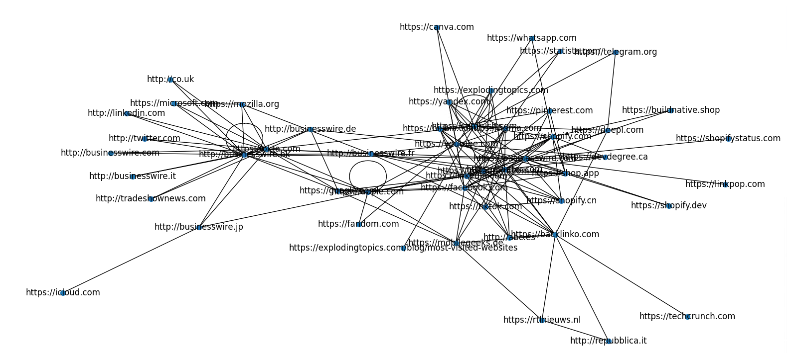
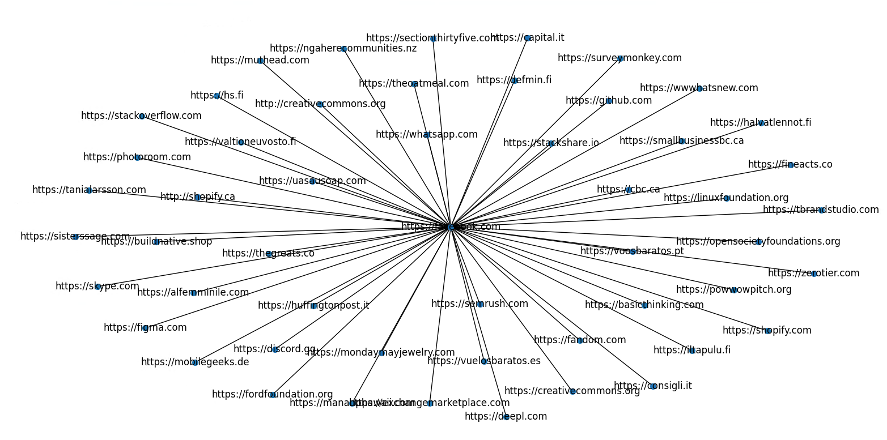

<a name="readme-top"></a>
[![Contributors][contributors-shield]][contributors-url]
[![Forks][forks-shield]][forks-url]
[![Stargazers][stars-shield]][stars-url]
[![Issues][issues-shield]][issues-url]


<!-- PROJECT LOGO -->
<br />
<div align="center">

  <h3 align="center">WebsiteGrapher</h3>

  <p align="center">
    These are the server and client files for the WebsiteGrapher Project
    <br />
    <a href="https://github.com/AnthonyBebek/WebsiteGrapher"><strong>Explore the docs »</strong></a>
    <br />
    <br />
    <a href="https://github.com/AnthonyBebek/WebsiteGrapher">View Demo</a>
    ·
    <a href="https://github.com/AnthonyBebek/WebsiteGrapher/issues">Report Bug</a>
    ·
    <a href="https://github.com/AnthonyBebek/WebsiteGrapher/issues">Request Feature</a>
  </p>
</div>


<!-- TABLE OF CONTENTS -->
<details>
  <summary>Table of Contents</summary>
  <ol>
    <li>
      <a href="#about-the-project">About The Project</a>
      <ul>
        <li><a href="#built-with">Built With</a></li>
      </ul>
    </li>
    <li>
      <a href="#getting-started">Getting Started</a>
      <ul>
        <li><a href="#installation">Installation</a></li>
      </ul>
    </li>
    <li><a href="#usage">Usage</a></li>
    <li><a href="#contributing">Contributing</a></li>
    <li><a href="#contact">Contact</a></li>
  </ol>
</details>


<!-- ABOUT THE PROJECT -->
## About The Project

This is a small project I worked on through my first year at the University of Canberra. It builds a list of websites by finding links shown on other websites, and then displays a map of websites that advertise your website.

### Getting Urls
A flask server runs on the server through port 27016 while the client script can run on any machine as long as they can communicate to the server through that port


The urls are stored on a mysql server hosted on the server with the create scripts.
```
CREATE TABLE `sites` (
	`ID` INT(11) NOT NULL AUTO_INCREMENT,
	`Ref` INT(11) NULL DEFAULT '1',
	`Links` VARCHAR(16384) NULL DEFAULT '0' COLLATE 'latin1_swedish_ci',
	`Checked` TINYINT(4) NULL DEFAULT '0',
	`URL` TEXT NULL DEFAULT NULL COLLATE 'latin1_swedish_ci',
	PRIMARY KEY (`ID`) USING BTREE,
	INDEX `Checked` (`Checked`) USING BTREE
)
COLLATE='latin1_swedish_ci'
ENGINE=InnoDB
AUTO_INCREMENT=1
;

CREATE TABLE `stats` (
	`ID` INT(11) NOT NULL AUTO_INCREMENT,
	`WebLogged` INT(11) NULL DEFAULT '0',
	`WebSearch` INT(11) NULL DEFAULT '0',
	`Clients` INT(11) NULL DEFAULT '0',
	`Datetime` DATETIME NULL DEFAULT NULL,
	PRIMARY KEY (`ID`) USING BTREE
)
COLLATE='utf8mb4_general_ci'
ENGINE=InnoDB
;

```

I have recorded roughly 30,000 websites with this setup and have used only 4 Mib of storage data.

### Viewing data

You can view websites by running ```Graphing.py``` in the terminal. This will show 50 random websites and how they link to eachother



*Note: This will be cleaned up*

By running ```SmartGraphing.py``` you can provide a URL and see what websites link to that URL. 



*Note: This is 50 random websites that reference https://facebook.com, Websites with more than 50 references gives you the option to limit the selection to 50.*


*Note: Navigate to http://{Server IP}:27016/stats to view the DB stats and any incoming URLs*

<p align="right">(<a href="#readme-top">back to top</a>)</p>


### Built With

This project was built with

* 
* 
* 
* 

<p align="right">(<a href="#readme-top">back to top</a>)</p>

<!-- GETTING STARTED -->
### Main Contributior

Anthony Bebek  
* [![LinkedIn][linkedin-shield]](https://www.linkedin.com/in/anthony-bebek-52b30a2b7/)

<!-- GETTING STARTED -->

## Getting Started

#### Git

#### Install for Windows

1. Visit the official git website: https://git-scm.com/download/win

2. Click on the "Click here to download" button to download git.

3. Once the installer is downloaded, double-click on it to start the installation process.

4. Follow the on-screen instructions to complete the installation.

5. During installation, git might require enabling certain features or restarting your system. Follow the prompts accordingly.

#### Install for linux

1. Run the following command 
``` sudo apt install git-all ```

### Installation

#### Client Setup

To run the client scripts, the client must have python3 installed on the system which can be found <a href = "https://www.python.org/downloads/">here</a>

1. Open up a command prompt window or temrinal and navigate to where you want to clone this repo to

2. Run the following command ``` git clone https://github.com/AnthonyBebek/WebsiteGrapher```

3. Run the following commands ```python3 -m pip install requests beautifulsoup4 colorama```

4. Change SererIP to point towards your server e.g ```ServerIP = "http://127.0.0.1:27016"```

5. Run ```python3 /WebsiteGrapher/RunClient.py```

#### Server Setup

To run the server scripts, the client must have python3 installed on the system which can be found <a href = "https://www.python.org/downloads/">here</a>

1. Open up a command prompt window or temrinal and navigate to where you want to clone this repo to

2. Run the following command ``` git clone https://github.com/AnthonyBebek/WebsiteGrapher```

3. Run the following commands ```python3 -m pip install flask colorama datetime logging```

4. Install mariaDB from <a href = "https://mariadb.org/download/?t=mariadb&p=mariadb&r=11.3.2">here</a>

5. Create a new file in the WebsiteGrapher directory called ```db_config.py``` and paste in 
```
    db_config = {
    'host': '127.0.0.1',
    'user': '{MARIADB USERNAME}',
    'password': '{MARIADB PASSWORD}',
    'database': 'websites'
    }
``` 
Make sure to put your replace {MARIADB USERNAME} with your the username you set in the previous step and {MARIADB PASSWORD} with the password

6. Run ```python3 /WebsiteGrapher/URLServer.py```

<p align="right">(<a href="#readme-top">back to top</a>)</p>


<!-- USAGE EXAMPLES -->
## Usage

This system is built to be run on a single machine but can also be run on a large network. If you intend to run the clients for a long time, make sure you are running multiple as google might think you are dos attacking their servers, and make you fill out a capta when you go to https://google.com

See the [open issues](https://github.com/AnthonyBebek/WebsiteGrapher/issues) for a full list of proposed features (and known issues).

<p align="right">(<a href="#readme-top">back to top</a>)</p>

<!-- CONTRIBUTING -->
## Contributing

Contributions are what make the open source community such an amazing place to learn, inspire, and create. Any contributions you make are **greatly appreciated**.

If you have a suggestion that would make this better, please fork the repo and create a pull request. You can also simply open an issue with the tag "enhancement".
Don't forget to give the project a star! Thanks again!

1. Fork the Project
2. Create your Feature Branch (`git checkout -b feature/AmazingFeature`)
3. Commit your Changes (`git commit -m 'Add some AmazingFeature'`)
4. Push to the Branch (`git push origin feature/AmazingFeature`)
5. Open a Pull Request

<p align="right">(<a href="#readme-top">back to top</a>)</p>


<!-- CONTACT -->
## Contact

Anthony Bebek - ante@viagi.com
* [![LinkedIn][linkedin-shield]](https://www.linkedin.com/in/anthony-bebek-52b30a2b7/)

Project Link: [https://github.com/AnthonyBebek/WebsiteGrapher](https://github.com/AnthonyBebek/WebsiteGrapher)

<p align="right">(<a href="#readme-top">back to top</a>)</p>

<!-- MARKDOWN LINKS & IMAGES -->
<!-- https://www.markdownguide.org/basic-syntax/#reference-style-links -->
[contributors-shield]: https://img.shields.io/github/contributors/AnthonyBebek/WebsiteGrapher.svg?style=for-the-badge
[contributors-url]: https://github.com/AnthonyBebek/WebsiteGrapher/graphs/contributors
[forks-shield]: https://img.shields.io/github/forks/AnthonyBebek/WebsiteGrapher.svg?style=for-the-badge
[forks-url]: https://github.com/AnthonyBebek/WebsiteGrapher/network/members
[stars-shield]: https://img.shields.io/github/stars/AnthonyBebek/WebsiteGrapher.svg?style=for-the-badge
[stars-url]: https://github.com/AnthonyBebek/WebsiteGrapher/stargazers
[issues-shield]: https://img.shields.io/github/issues/AnthonyBebek/WebsiteGrapher.svg?style=for-the-badge
[issues-url]: https://github.com/AnthonyBebek/WebsiteGrapher/issues
[license-shield]: https://img.shields.io/github/license/AnthonyBebek/WebsiteGrapher.svg?style=for-the-badge
[license-url]: https://github.com/AnthonyBebek/WebsiteGrapher/blob/master/LICENSE.txt
[linkedin-shield]: https://img.shields.io/badge/-LinkedIn-black.svg?style=for-the-badge&logo=linkedin&colorB=555
[linkedin-url]: https://linkedin.com/in/linkedin_username
[product-screenshot]: images/screenshot.png
[Next.js]: https://img.shields.io/badge/next.js-000000?style=for-the-badge&logo=nextdotjs&logoColor=white
[Next-url]: https://nextjs.org/
[React.js]: https://img.shields.io/badge/React-20232A?style=for-the-badge&logo=react&logoColor=61DAFB
[React-url]: https://reactjs.org/
[Vue.js]: https://img.shields.io/badge/Vue.js-35495E?style=for-the-badge&logo=vuedotjs&logoColor=4FC08D
[Vue-url]: https://vuejs.org/
[Angular.io]: https://img.shields.io/badge/Angular-DD0031?style=for-the-badge&logo=angular&logoColor=white
[Angular-url]: https://angular.io/
[Svelte.dev]: https://img.shields.io/badge/Svelte-4A4A55?style=for-the-badge&logo=svelte&logoColor=FF3E00
[Svelte-url]: https://svelte.dev/
[Laravel.com]: https://img.shields.io/badge/Laravel-FF2D20?style=for-the-badge&logo=laravel&logoColor=white
[Laravel-url]: https://laravel.com
[Bootstrap.com]: https://img.shields.io/badge/Bootstrap-563D7C?style=for-the-badge&logo=bootstrap&logoColor=white
[Bootstrap-url]: https://getbootstrap.com
[JQuery.com]: https://img.shields.io/badge/jQuery-0769AD?style=for-the-badge&logo=jquery&logoColor=white
[JQuery-url]: https://jquery.com 
